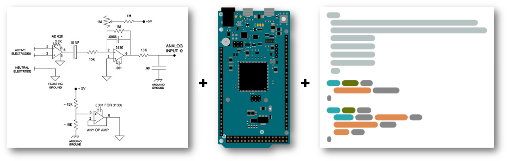
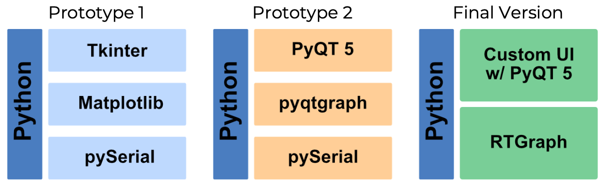
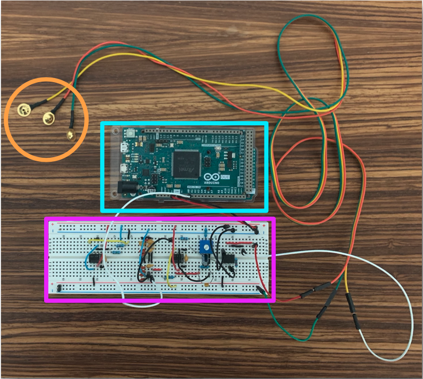
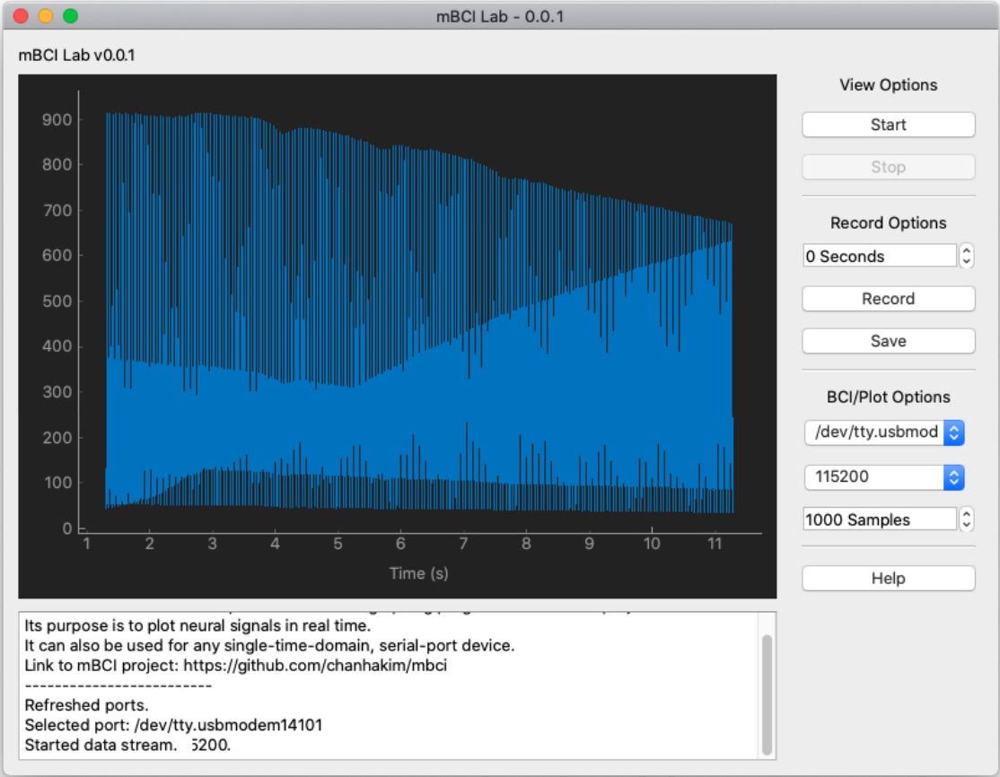

# mBCI (RAISE 2020 Project)

Building an Arduino-Based Brain-Computer Interface and Writing a Real-Time Signal Plotting Program

## Introduction

With the recent progress of startups like Neuralink and Neurable, *brain-computer interfaces* are emerging as ‘the next big thing’ in the consumer tech market. A brain-computer interface or BCI is a device that can read and interpret neural signals, such as electroencephalography (EEG). BCIs are interdisciplinary, combining neuroscience, circuits, signal processing and machine learning, and their immense complexity often requires a team of experts to create a novel system. This project aimed to understand basic neuroscience and circuit concepts and resulted in creating an Arduino-based BCI and a real-time signal plotting program (mBCI Lab). Specifically, an Arduino Duemila and an EEG circuit design from an existing BCI project were used to create the BCI circuit, and the real-time signal plotting program was based upon a Python-based, real-time graphing project by Sepúlvelda et al. in 2014. 

## In This Repository

- **arduino** – Arduino code used to drive the BCI
  - **100Hz** – Arduino code for reading single-channel signal @ 100 Hz
  - **200Hz** – Arduino code for reading single-channel signal @ 200 Hz
- **datasheets** – instrument & operational amplifier datasheets used in BCI circuit
- **guis** – mBCI Lab v0.0.1 + prototype GUIs
  - **mbci_lab** – link to mbci_lab repository (main GUI for the mBCI project)
  - **pyqt5** – pyqt5-based prototype GUI
  - **tkinter** – tkinter-based prototype GUI
- **misc** – miscallenous code examples + Flicker Lab (checkerboard pattern flicker program)
- **papers** – papers/articles/links used in mBCI project
- **photos** – photos of BCI + mBCI Lab + circuit schematics

## RAISE Project Details

### Guiding Question

How do brain-computer interfaces work and how do I build one?

### Project Goals

To learn how brain-computer interfaces work and build a minimal BCI circuit + a real-time signal plotting program.

### Background

Brain-computer interfaces are systems that read and interpret signals from the nervous system to enhance the interaction between humans and their environments. Numerous types of BCIs exist and are differentiated mainly based on the signal that they read (e.g. EEG vs MEG) and whether the technology is invasive(e.g. invasive vs non-invasive EEG). The non-invasive, EEG BCIs, which are explored in this project, read electroencephalography (i.e. the electrical activity of the brain) by attaching electrodes to the scalp without entering the skin. Non-invasive EEG BCIs are implemented as electronic circuits and require modules that amplify and filter the brain’s electrical signal (measured in volts). Leveraging BCI technology enables biomedical engineers to develop neurologically seamless prosthetic limbs, helps researchers study the physiological processes of cognition, and allows consumers to interact with their environments on a more intimate level.

### Schedule and Learning Materials

- Week 1: Learning the basics of neuroscience, BCI, and neural signals.
  - *Principles of Neurobiology* (Luo 2016)
  - *Brain Computer-Interfaces: Principles and Practice* (Wolpaw & Wolpaw 2011)
- Week 2: Learning C/C++ syntax and setting up Arduino coding environment.
  - Codecademy C & C++ courses
  - Arduino Programming Language Reference
- Week 3: Learning the basics of circuits and building BCI circuit.
  - https://www.allaboutcircuits.com/
  - http://faculty.olin.edu/bstorey/isim.pdf
  - Existing EEG BCI Projects:
    - https://www.instructables.com/id/DIY-EEG-and-ECG-Circuit/
    - https://people.ece.cornell.edu/land/courses/ece4760/FinalProjects/s2012/cwm55/cwm55_mj294/
    - https://sites.google.com/site/chipstein/home-page/eeg-with-an-arduino
- Week 4: Building the real-time signal plotting software.
  - Tkinter, Matplotlib, PyQt5, pySerial, pyqtgraph5, RTGraph documentations
- Week 5: Finishing the real-time signal plotting software and testing the BCI circuit and signal acquisition software.

### Approach

#### Building the circuit

**Figure 1. A diagram of BCI components.** The three components are the circuit design (left) borrowed from chipstein’s “EEG With an Arduino Project” [2], the Arduino Due (middle) [3], and the Arduino firmware code sampling at 100 Hz (right).

#### Building the software

**Figure 2. A diagram of UI tech stacks.** A tech stack is the set of technologies a program uses. Each tech stack corresponds to a prototype real-time signal plotting program created in this project. The final version of the program uses RTGraph, a real-time signal plotting program implemented in Python [4].

### Results

#### mBCI (a minimal brain-computer interface)

**Figure 3. An image of a minimal BCI.** The circuit uses an Arduino Due (boxed in cyan) and connects to a computer via a micro-USB to USB cable (not pictured). The electrodes (circled in orange) connect to the locations on the scalp associated with the desired neural signal, and the amplification/filter module (boxed in light purple) amplifies and filters the neural signal. Amplification increases the strength of the signal, and filtering removes the unwanted noise in the signal. This BCI circuit is minimal in the sense that it reads neural signal from a single location and utilizes a relatively basic amplifier-and-filter module.

#### mBCI Lab v0.0.1 (a real-time signal plotting/recording program)

**Figure 4. A screenshot of** **mBCI** **Lab.** mBCI Lab is based on Sepúlvelda et al.’s RTGraph project, a real-time signal plotting program written in Python. Specifically, mBCI Lab utilizes the backend processing of RTGraph and introduces a new graphical user interface for interacting with the mBCI. The former is written as a fork (or copy) of the latter. *The signal present in this screenshot is random noise from a BCI that is not connected to a subject.

### Key Takeaways

- BCIs are systems that read and interpret neural signal. mBCI can read single-channel EEG at 100 or 200 Hz.
- In the context of non-invasive EEG BCIs, neural signal is electro-encephalography (measured in volts). EEG arises from populations of neurons that release electrical signal towards the skin surface.
- Circuits are collections of wires, capacitors, resistors, and other electronic components that direct the flow of electricity. Circuit modules are used to detect electrical activity from the brain and pass it along to a computer as a digital value. Differential amplifiers can read the electrical difference between two scalp locations and compose the main part of a BCI.

### Next Steps

- Review circuit fundamentals and learn more advanced circuits topics.
- Collect neural data based on signal acquisition techniques found in academic literature.
- Analyze neural data using neural signal analysis.
- Leverage machine learning to calibrate different frequencies of neural signals to actionable tasks (e.g. moving a cursor on a screen).

### References

1. Wolpaw, J.R. & Wolpaw, E.W. (Eds.). (2011). *Brain-Computer Interfaces: Principles and Practice*. Oxford. 
2. Chipstein. (N.d.). *EEG With an Arduino*. chipstein. https://sites.google.com/site/chipstein/home-page/eeg-with-an-arduino
3. Arduino. (N.d.). *Arduino Due*. Arduino Store. https://store.arduino.cc/usa/due
4. Sepúlvelda, S. (2015, January 1). *RTGraph*. GitHub. https://github.com/ssepulveda/RTGraph

### Acknowledgements

I'd like to thank Professor Osborn (Pomona College Computer Science) for his mentorship, the Fletcher Jones Foundation for funding my summer project, and my friend Manu Patil (Olin College, EECS, Class of 2022) for answering my questions about circuits.